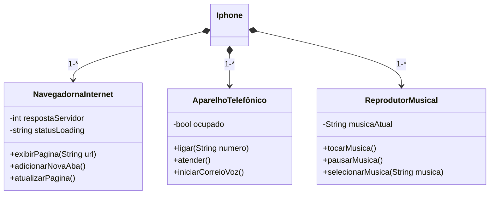

# DIO - Trilha Java Básico

Classe a ser implementada conforme solicitado

```mermaid
classDiagram
    Iphone *--> Navegador na Internet :1-* 
    Iphone *--> Aparelho Telefônico :1-* 
    Iphone *--> Reprodutor Musical:1-* 
    Reprodutor Musical : -String musicaAtual
    Reprodutor Musical : +tocarMusica()
    Reprodutor Musical : +pausarMusica()
    Reprodutor Musical : +selecionarMusica(String musica)
    Aparelho Telefônico: -bool ocupado
    Aparelho Telefônico : +ligar(String numero)
    Aparelho Telefônico : +atender()
    Aparelho Telefônico: +iniciarCorreioVoz()
    Navegador na Internet : -int respostaServidor
    Navegador na Internet : -string statusLoading
    Navegador na Internet : +exibirPagina(String url)
    Navegador na Internet : +adicionarNovaAba()
    Navegador na Internet : +atualizarPagina()
```